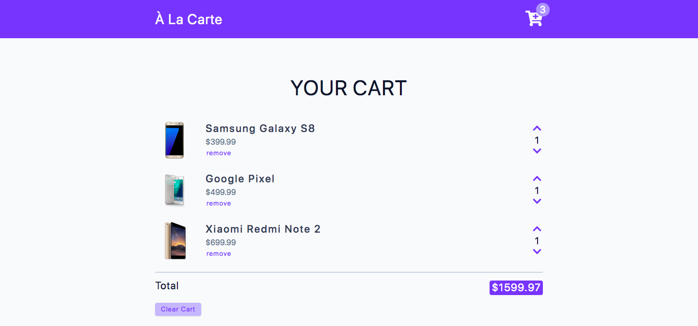

# À La Carte



## Project Description

**À La Carte** is an e-commerce application that features a fully functional and user-friendly cart, designed to provide a seamless shopping experience on both large and small screens. Built using `Vite`, `JavaScript`, `React.js`, `React Icons`, `HTML`, and `CSS`, this project showcases a cart with extensive functionality, allowing users to view, modify, and adjust their selected items before proceeding to the checkout process.

**À La Carte** empowers users with the ability to curate their shopping experience, view their selected items, and effortlessly manage their cart contents before proceeding to checkout. With its intuitive design and dynamic functionality, the application aims to create a pleasant and user-friendly e-commerce experience.

*Please note that the project can be further enhanced with additional features, such as user authentication, payment processing integration, and inventory management, to provide a comprehensive e-commerce solution.*

## Important Links

- https://alacarte-im.netlify.app/

### Setup Steps

1. [Fork and Clone](https://github.com/iamatos3/a-la-carte) this repository.
2. ```npm install```
3. ```npm run dev```

### Technologies Used

- Vite
- JavaScript
- React.js
- React Icons
- HTML
- CSS